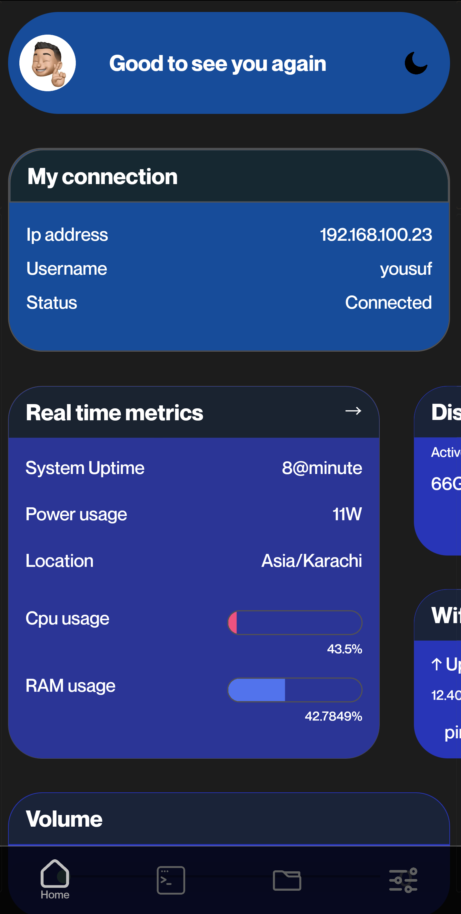
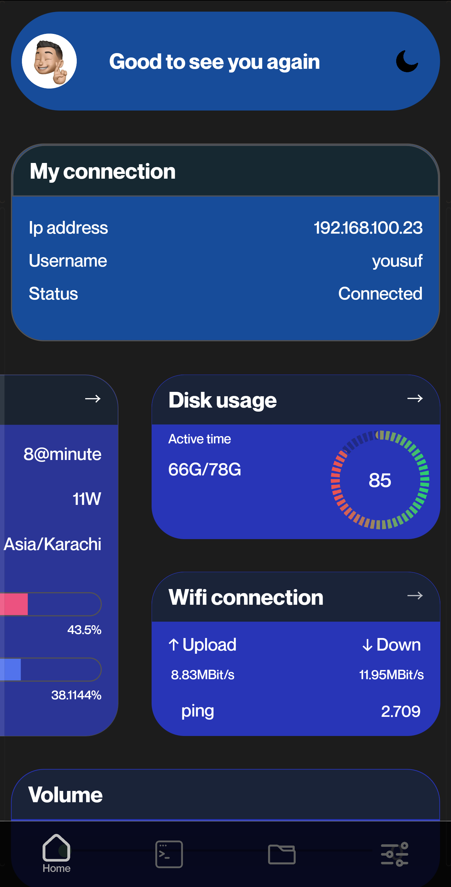
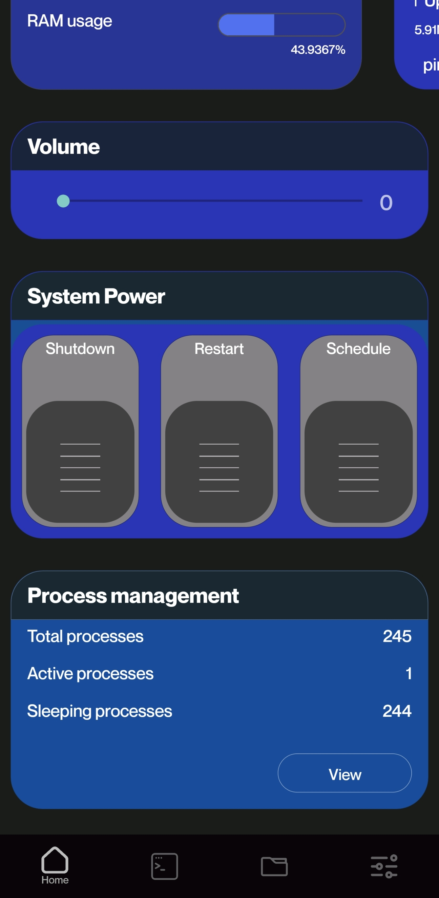
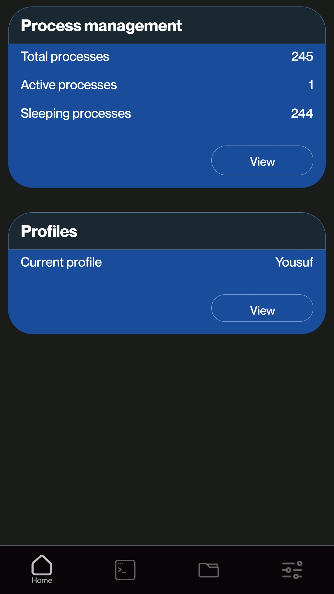
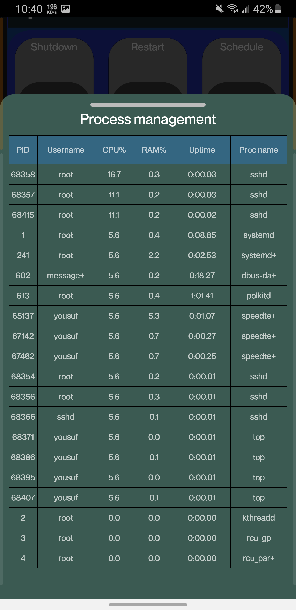
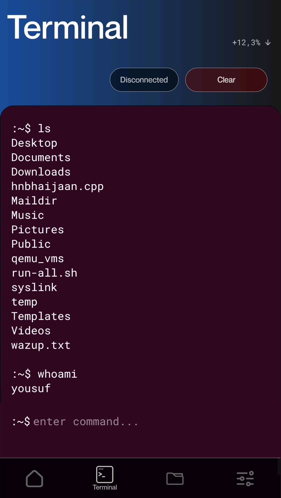
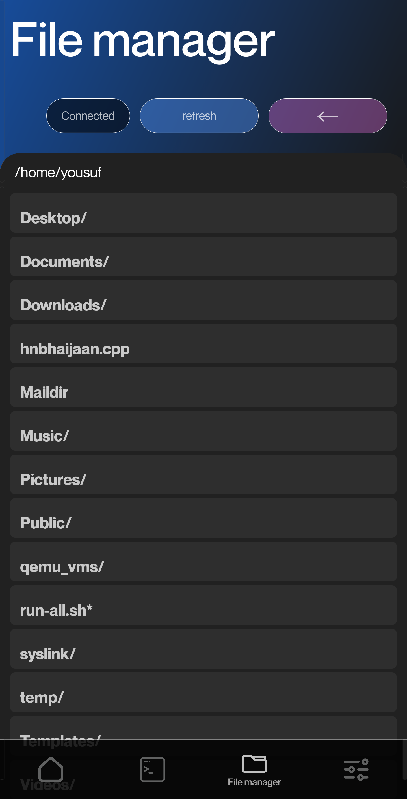
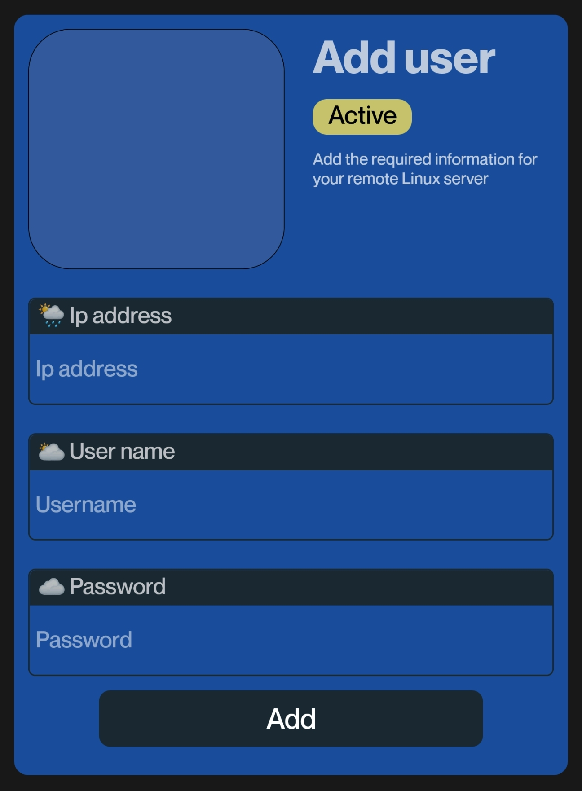

# SysLink: Empower Your Machines - Remote System Monitoring and Control 
---
### Watch Video:
[](https://www.youtube.com/watch?v=OOE7VMgPxB8)


SysLink is a mobile application designed to give you unparalleled remote control and insights into your computer's performance. Whether you're running Windows or Linux, SysLink enables seamless remote monitoring and management. Dive into a world of possibilities and take command of your machine from anywhere.

## Features

### Monitoring:
- **Computer Uptime:** Track the longevity of your system's active state.
- **System Power Usage:** Monitor real-time power consumption for a sustainable approach.
- **Computer Location:** Pinpoint the geographical location of your computer.
- **Real-time CPU Usage:** Witness your CPU's performance with dynamic real-time updates.
- **Real-time RAM Usage:** Keep tabs on your system's memory utilization in real-time.
- **Real-time Disk Consumption:** Track disk space usage as it happens.
- **Real-time WiFi Stats:** Stay connected with real-time WiFi up and downtime in Mb/s, alongside WiFi ping.
- **Network Information:** Explore detailed network insights including hostname, interface, and connection type.


  
  <br>
  


### Control:
- **Remote Volume Control:** Fine-tune your system's audio remotely.
- **Scheduled Shutdowns:** Automate your PC's shutdowns with convenient scheduling.
- **Immediate Shutdown:** Turn off your PC remotely at a moment's notice.
- **Restart:** Initiate a remote restart for a fresh system start.
    


### Process Management:
- **Process Count:** Gauge the overall number of processes running on your computer.
- **Active and Sleeping Processes:** Monitor the status of active and sleeping processes.
- **Task Manager View:** Peek into your system's task manager remotely.
- **Profile Information:** Check the count of active and inactive user profiles on your computer.
  
    
    

### Remote Terminal Access:
- **Full Terminal Control:** Take command with complete control over your PC through the command line.
  
    
   

   
- **File System Access:** Navigate and manage system files and folders with the remote file manager.
    

# Getting Started with SysLink

To start using SysLink, follow these simple steps:

1. Clone the project using Git:

    ```bash
    git clone https://github.com/yousuf-4594/Syslink.git
    ```

2. Navigate to the download folder:

    ```bash
    cd download/syslink
    ```

   Replace `download` with the actual directory where you downloaded SysLink.

3. For Android devices, run the following command:

    ```bash
    npm run android
    ```

   This will build and run the SysLink app on your Android device.

4. Add your machine Ip Adress, username and password in settings menu
    

Now you're all set to explore the powerful features of SysLink on your mobile device! Connect to your computer, monitor in real-time, and take control remotely.


## Compatibility

SysLink is compatible with computers running Windows and Linux.

## Contribution

We welcome contributions! If you find any issues or have ideas for improvement, feel free to create a pull request.

## License

This project is licensed under the [MIT License](LICENSE).

---


[](https://github.com/yousuf-4594/Syslink/issues)
